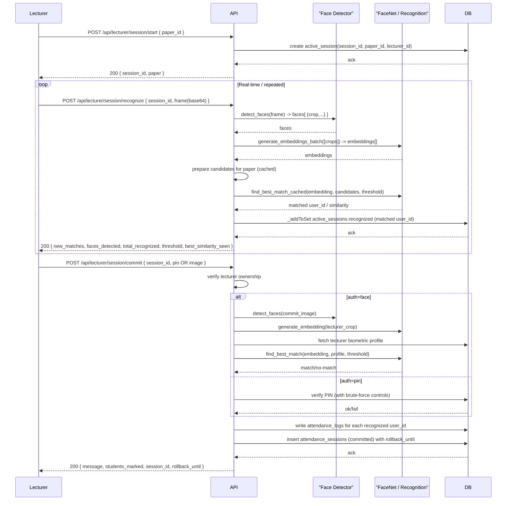

# Concise Workflows: Login, Face Enrollment, and Attendance Recognition

This guide keeps only the three workflows that the application actually implements in the reviewed code paths: login authentication, student face enrollment, and lecturer attendance-session face recognition.

---

## 1. Login Authentication

Summary
- Endpoint: `POST /api/auth/login`
- Purpose: authenticate credentials, issue JWT cookies, and return the user context.

Request body
- `email` and `password` are required.

Behavior
- Validates email format.
- Checks brute-force lockout and IP rate limits when enabled.
- Verifies the password hash.
- On success, issues both access and refresh tokens, sets them as secure HttpOnly cookies, and returns serialized user details.
- On failure, returns `401` for invalid credentials or `429` if the account/IP is locked.

Relevant config
- `JWT_SECRET_KEY`
- `JWT_ACCESS_TOKEN_EXPIRES_SECONDS`
- `BRUTE_FORCE_PROTECTION_ENABLED`
- `LOGIN_LOCKOUT_THRESHOLD`
- `LOGIN_LOCKOUT_DURATION_MINUTES`
- `IP_RATELIMIT_*`

Notes
- Token validity is also enforced through revocation checks and the user's `session_version`.

---

## 2. Student Face Enrollment

Summary
- Endpoint: `POST /api/admin/students/enroll`
- Purpose: store a student's face embedding, and optionally save a small dataset for later training.

Request body
- `user_id` is required.
- `photo` is required and must be a base64-encoded image.
- `dataset_photos` is optional and may contain up to 50 base64-encoded frames.

Behavior
- Decodes the base64 image.
- Runs face detection.
- If no face is found, returns `400`.
- Uses the first detected face crop to generate a FaceNet embedding and stores it in the student's profile.
- If `dataset_photos` are supplied, it extracts crops from up to 50 frames and stores them under `dataset/{user_id}/`.
- Returns `faces_detected` and `dataset_saved_count`.

Relevant config
- `FACE_EMBEDDING_ENCRYPTION_KEY`
- `DATASET_RETENTION_DAYS`
- `TRAINER_ARTIFACT_RETENTION_DAYS`

Notes
- Related training endpoints exist separately, but they are not part of the core enrollment flow.

---

## 3. Attendance Session Face Recognition

Summary
- Start session: `POST /api/lecturer/session/start`
- Recognize webcam frame: `POST /api/lecturer/session/recognize`
- Recognize uploaded classroom image: `POST /api/lecturer/session/recognize-image`
- Commit attendance: `POST /api/lecturer/session/commit`

Start session
- Requires `paper_id`.
- Validates the lecturer is assigned to the paper and the course is active.
- Creates an active session with a generated `session_id`.

Recognition flow
- Accepts either a base64 webcam frame or a multipart uploaded image.
- Detects faces in the frame/image.
- Generates embeddings in batch for the detected face crops.
- Matches them against the enrolled students for the current paper.
- Adds newly recognized student IDs to the active session's `recognized` set.
- Returns the matches and recognition metadata.

Commit flow
- Finalizes attendance for the active session.
- Commitment auth is controlled by `LECTURER_AUTH_MODE`:
  - `pin` mode verifies the lecturer PIN.
  - `face` mode verifies the lecturer against their enrolled biometric profile.
- Writes attendance logs for the recognized students.
- Creates the committed `attendance_sessions` record with a `rollback_until` timestamp.

Relevant config
- `LECTURER_AUTH_MODE`
- `FACENET_THRESHOLD`
- `ACTIVE_SESSION_TIMEOUT_MINUTES`

Notes
- The rollback window is 30 minutes from commit.
- Only the assigned lecturer can start, recognize for, or commit the session.

---

## Diagrams (Mermaid)

Login Authentication (flowchart)
```mermaid
flowchart TD
  A[Client → POST /api/auth/login\n{ email, password }] --> B{Brute-force protection\nenabled?}
  B -->|Locked| C[Return 429: Account locked (lockout_until)]
  B -->|OK| D[Validate email format]
  D -->|Invalid| E[Return 400: Invalid email]
  D -->|Valid| F[Lookup user & verify password]
  F -->|Fail| G[Record failed attempt → 401 Invalid credentials]
  F -->|Success| H[Clear failed attempts; log login_success]
  H --> I[Create Access & Refresh JWTs (claims include sv, role, dept)]
  I --> J[Set secure HttpOnly cookies (access, refresh)]
  J --> K[Return 200 + serialized user context]
  K --> L[Subsequent requests: token revocation check\n(revoked_jwts + user.session_version)]
```

Student Face Enrollment (flowchart)
```mermaid
flowchart TD
  A[Client → POST /api/admin/students/enroll\n{ user_id, photo (base64), dataset_photos? }] --> B[Decode base64 image]
  B -->|Invalid| C[Return 400: Invalid image]
  B --> D[Run face detector → faces[]]
  D -->|none| E[Return 400: No face detected]
  D -->|has faces| F[Select primary crop (faces[0].crop)]
  F --> G[generate_embedding(crop) → 512-d vector]
  G --> H[add_face_embedding(user_id, embedding) → persist to student_profiles]
  H --> I{dataset_photos provided?}
  I -->|yes| J[Process up to 50 frames: detect crops, fill missing with last valid]
  J --> K[save_cropped_face_dataset(dataset/{user_id}/) → dataset_saved_count]
  I -->|no| L[skip dataset save]
  K --> M[Log ENROLL_FACE audit, clear caches]
  L --> M
  M --> N[Return 200: Face enrolled successfully\n(faces_detected, dataset_saved_count)]
```

Attendance Session — Face Recognition (sequence)

- Update timetable status: PATCH `/api/timetable/admin/{timetable_id}/status`
- Delete timetable: DELETE `/api/timetable/admin/{timetable_id}`
- Scope metadata endpoints:
  - GET `/api/timetable/academic-sessions`
  - GET `/api/timetable/papers`

Generate request example:

```json
{
  "department_id": "69da6f26cd4bb4ef527e9721",
  "course_id": "69da6f26cd4bb4ef527e972b",
  "academic_session": "2026-28",
  "semester": 1,
  "class_duration_minutes": 60,
  "class_start_time": "09:00",
  "class_end_time": "16:00",
  "recess_start_time": "12:30",
  "recess_end_time": "13:00",
  "max_classes_per_day": 4,
  "status": "draft"
}
```

Slot update request example:

```json
{
  "slots": [
    {
      "slot_id": "6803a977f1fd79175a07b3f1",
      "paper_id": "69da7292cd4bb4ef527e9735"
    }
  ]
}
```

Lecturer timetable endpoint:

- GET `/api/timetable/lecturer/my`

Student timetable endpoint:

- GET `/api/timetable/student/my`

## 3. Lecturer workflows

### 3.1 Set PIN

- Endpoint: PUT /api/lecturer/pin
- Required fields:
  - pin
- Validation rules:
  - exactly 4 digits

Request example:

```json
{
  "pin": "1234"
}
```

### 3.2 Start session

- Endpoint: POST /api/lecturer/session/start
- Required fields:
  - paper_id
- Validation rules:
  - paper must exist
  - paper course must be active
  - lecturer must be assigned to paper

Request example:

```json
{
  "paper_id": "69da7292cd4bb4ef527e9735"
}
```

### 3.3 Live frame recognition

- Endpoint: POST /api/lecturer/session/recognize
- Required fields:
  - session_id
  - frame

Request example:

```json
{
  "session_id": "ff290922-d579-4ad6-8c8e-d1658779c048",
  "frame": "data:image/png;base64,iVBORw0KGgoAAA..."
}
```

### 3.4 Classroom image recognition

- Endpoint: POST /api/lecturer/session/recognize-image
- Content type: multipart/form-data
- Required fields:
  - session_id
  - image (file)

### 3.5 Commit attendance

- Endpoint: POST /api/lecturer/session/commit
- Required fields:
  - session_id
  - pin
- Validation rules:
  - valid 4-digit lecturer PIN
  - valid active session

Request example:

```json
{
  "session_id": "ff290922-d579-4ad6-8c8e-d1658779c048",
  "pin": "1234"
}
```

### 3.6 Adjust committed session

- Endpoint: PUT /api/lecturer/session/{session_id}/adjust
- Required fields:
  - pin
  - user_ids
- Validation rules:
  - rollback window must be active
  - PIN must match lecturer PIN

Request example:

```json
{
  "pin": "1234",
  "user_ids": [
    "69da6f37cd4bb4ef527e972d"
  ]
}
```

## 4. Student workflows

### 4.1 Profile

- Endpoint: GET /api/student/profile
- Purpose:
  - Current student profile with course and subjects

### 4.2 Attendance summary

- Endpoint: GET /api/student/attendance
- Purpose:
  - Per-paper attendance and class session details

### 4.3 Predictions

- Endpoint: GET /api/student/predictions
- Purpose:
  - Classes needed for 75% and safe bunk count

### 4.4 Eligibility

- Endpoint: GET /api/student/exam-eligibility
- Purpose:
  - Per-paper eligible/not-eligible status

## 5. Headers and auth for API clients

For mutation endpoints, include:

- Cookie from login response
- X-CSRF-TOKEN header from csrf_access_token cookie

Example header set:

```text
Cookie: access_token_cookie=<jwt>; csrf_access_token=<csrf>
X-CSRF-TOKEN: <csrf>
Content-Type: application/json
```

## 6. Source of truth

- OpenAPI contract: [/docs/openapi.yaml](../openapi.yaml)
- Functional operations manual: [/docs/operations/SYSTEM_OPERATIONS_MANUAL.md](../operations/SYSTEM_OPERATIONS_MANUAL.md)
- Command runbook: [/docs/operations/CLI_COMMAND_RUNBOOK.md](../operations/CLI_COMMAND_RUNBOOK.md)